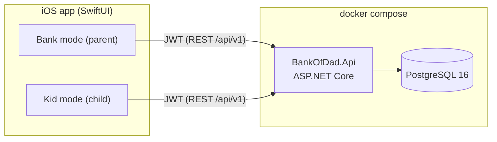

# Bank of Dad

Bank of Dad lets parents run a small, friendly "bank" for their kids: create loans with clear terms (optional interest, installment schedule, optional late fees), record repayments, and let kids follow their own progress on their own device.

- **Backend**: ASP.NET Core minimal API (.NET 10) + EF Core + PostgreSQL 16, run with Docker Compose.
- **iOS app**: a single SwiftUI app (iOS 17+). Each installation connects to its family's self-hosted server by QR; parents use email/password and children use username/password or username/PIN.
- **API contract**: [`docs/api-contract.md`](docs/api-contract.md) is the source of truth shared by both clients.

## Architecture



Backend layout (`backend/`):

| Project | Purpose |
|---|---|
| `src/BankOfDad.Domain` | Entities, amortization schedule, payment allocation, late-fee and terms-summary logic (pure, unit-tested). |
| `src/BankOfDad.Infrastructure` | EF Core `DbContext`, configurations, migrations. |
| `src/BankOfDad.Api` | Endpoints, JWT auth + refresh tokens, Apple sign-in, device pairing, APNs, background reminder/late-fee job. |
| `tests/BankOfDad.Domain.Tests` | Domain unit tests. |
| `tests/BankOfDad.Api.Tests` | Integration tests against a real PostgreSQL via Testcontainers. |

## Running the backend

Prerequisites: Docker Desktop (and the .NET 10 SDK if you want to build/test outside Docker).

```powershell
Copy-Item .env.example .env   # then edit database/JWT settings
docker compose up -d --build
curl http://localhost:8080/health   # -> Healthy
```

Database migrations are applied automatically when the API starts. To stop: `docker compose down` (add `-v` to wipe the database volume).
Compose waits for the API readiness check before completing `up -d`, so the
health request can run immediately after startup.

The Docker build uses NuGet's v2 endpoint by default because it is more
reliable from the .NET SDK container than the v3 service-index endpoint. If
your network requires a mirror, set `NUGET_SOURCE` in `.env` (or the
environment) to a reachable package feed before building; the Docker build
restores packages from it.

### Tests

```powershell
dotnet test backend
```

The API integration tests start a throwaway PostgreSQL container with Testcontainers, so Docker must be running.

### Development test hooks

For end-to-end UI tests the API can expose `/api/v1/testing/*` endpoints that backdate a loan's due dates and run the reminder / late-fee sweep immediately (see [`docs/api-contract.md`](docs/api-contract.md#testing-hooks-development-only-parent-only-callers-family-only)). They are mapped only when `ASPNETCORE_ENVIRONMENT=Development` **and** `TEST_HOOKS_ENABLED=true`. Both default to off in `docker-compose.yml`. `ios/scripts/run-ui-tests.sh` turns them on for its run. Never enable them in production.

### Push notifications (optional)

When `APNS_KEY_ID` is empty the API only logs notifications. To send real pushes, put your APNs `.p8` key at `./secrets/AuthKey.p8` (mounted read-only into the container), and set `APNS_KEY_ID`, `APNS_TEAM_ID`, `APNS_BUNDLE_ID`, and `APNS_USE_SANDBOX` in `.env`.

## Hosting at home (Tailscale)

To run the backend on an always-on Linux box or Raspberry Pi, use [`deploy/`](deploy/README.md). Family iPhones reach it at `https://bankofdad.<tailnet>.ts.net` over Tailscale, at home or away, with a trusted certificate. It runs the prebuilt multi-arch image from GHCR in Production mode and publishes nothing on the LAN. To run the same stack on a small Azure VM instead (about $13/month), see [`deploy/azure/`](deploy/azure/README.md).

## Running the iOS app

Requires a Mac with Xcode 15+ and [XcodeGen](https://github.com/yonaskolb/XcodeGen):

```sh
cd ios
brew install xcodegen
xcodegen generate
open BankOfDad.xcodeproj
```

See [`ios/README.md`](ios/README.md) for runtime server selection, secure QR enrollment, optional official-server Apple capabilities, and child credentials.

Apple distribution checklist:

1. Set `BANKOFDAD_BUNDLE_ID` and `DEVELOPMENT_TEAM` in `ios/Config/Local.xcconfig` (copy `Local.xcconfig.example`).
2. Public self-hosted servers do not need the app owner's Apple/APNs private keys; Inbox works without push.
3. To put the app on family phones, see [Install on family devices](ios/README.md#install-on-family-devices-testflight).

## Continuous integration

[`.github/workflows/ci.yml`](.github/workflows/ci.yml) runs on every pull request and on pushes to `main`:

| Job | What it checks |
|---|---|
| **Backend build & test** | Release build of `backend/BankOfDad.slnx` with compiler warnings as errors, then all domain and Testcontainers integration tests (TRX results uploaded as an artifact). |
| **Docker compose smoke test** | `docker compose build` and `up`, then waits for `GET /health` to return `Healthy`. |
| **iOS build & test** | On `macos-15`: `xcodegen generate`, then `xcodebuild test` of the `BankOfDad` scheme on the newest available iPhone simulator, with code signing disabled. The end-to-end `BankOfDadUITests` are skipped because they need the Docker backend; run them locally with `ios/scripts/run-ui-tests.sh`. |

To make these required for merging, add the three job names above as required status checks in the branch protection rule (or ruleset) for `main`.

[`.github/workflows/publish-image.yml`](.github/workflows/publish-image.yml) builds the API image for `linux/amd64` and `linux/arm64` on pull requests that touch `backend/`. On merges to `main` it also pushes the image to `ghcr.io/jpapiez/bankofdad-api` (`latest` and `sha-<short sha>`) for [home hosting](deploy/README.md). The image is public, so `docker pull` needs no login.

## Key rules

- Money is stored as `numeric(18,2)` (rates and percentages as `numeric(9,6)` fractions) and rounded half-away-from-zero to cents. Loan schedules use standard amortization; the last installment absorbs rounding. For example, $300 at 5% APR over 6 monthly payments gives $50.73 per installment, $4.39 total interest, and $304.39 total repayable.
- Payments go to outstanding late fees first (oldest first), then to each installment in order, interest before principal.
- Late fees (flat and/or percent of the missed installment) are charged once per installment after the grace period.
- Kids see only their own loans. Parents in the same family share a single bank.

## License

[MIT](LICENSE)
