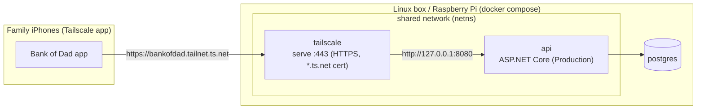

# Hosting Bank of Dad at home (Tailscale)

Run the backend on an always-on Linux box or Raspberry Pi and reach it from every family iPhone, at home or away, with trusted HTTPS. No spare hardware? Run the same stack on a small Azure VM with [`azure/`](azure/README.md).



- **Only reachable over the tailnet.** Nothing is published on the LAN. The API is also on `127.0.0.1:8080` on the box, for health checks.
- **Trusted HTTPS.** Tailscale provisions a real certificate for the node's `*.ts.net` name, so the app needs no App Transport Security exceptions.
- **Prebuilt image.** The API image (`linux/amd64` + `linux/arm64`) is built by [`.github/workflows/publish-image.yml`](../.github/workflows/publish-image.yml) and pushed to `ghcr.io/jpapiez/bankofdad-api` on every merge to `main`. Tags are `latest` and `sha-<short sha>`. The image is public, so no registry login is needed.

## Requirements

- **A server:** a Linux box or a Raspberry Pi running a **64-bit** OS (e.g. Raspberry Pi OS 64-bit or Ubuntu). It needs Docker Engine with the compose plugin, and Docker must start at boot (`sudo systemctl enable --now docker`).
- **A Tailscale account.** Each family member installs the Tailscale app on their iPhone and joins your tailnet, or you share the server with their own tailnet (see [Family devices](#family-devices)).

## 1. Prepare the tailnet (once)

In the [Tailscale admin console](https://login.tailscale.com/admin):

1. **DNS:** enable **MagicDNS** and **HTTPS Certificates**. Certificates are recorded in public Certificate Transparency logs, so the node name and tailnet name (`bankofdad.<tailnet>.ts.net`) become publicly visible. The server is still reachable only from your tailnet.
2. **Settings → Keys → Generate auth key.** The key is only used for the server's first login; afterwards its identity lives in the `tailscale-state` volume.
   - **Recommended:** tag the node. Add `"tagOwners": {"tag:bankofdad": ["autogroup:admin"]}` to your access-control policy, generate the key with the `tag:bankofdad` tag, and set `TS_EXTRA_ARGS=--advertise-tags=tag:bankofdad`. Tagged nodes don't expire.
   - **Without a tag:** after the node joins, open **Machines → bankofdad → Disable key expiry**. Otherwise it drops off the tailnet when its key expires (180 days by default).

## 2. Install and start

The server only needs this `deploy/` folder. Copy it over, e.g. `scp -r deploy user@server:~/bankofdad`, or clone the repository. Then:

```sh
cd ~/bankofdad            # the deploy/ folder
cp .env.example .env      # set POSTGRES_PASSWORD, JWT_SIGNING_KEY, TS_AUTHKEY (see comments)
chmod 600 .env
mkdir -p secrets          # optional: APNs AuthKey.p8 goes here
docker compose up -d
docker compose logs -f tailscale      # wait until it reports it is running and serving
curl http://127.0.0.1:8080/health     # -> Healthy
```

From any device on the tailnet: `curl https://bankofdad.<tailnet>.ts.net/health` → `Healthy`. The first HTTPS request provisions the certificate and can take a few seconds.

The compose file refuses to start without `POSTGRES_PASSWORD` and `JWT_SIGNING_KEY`. The API runs in **Production**: it requires a 32+ character signing key, hides exception details and OpenAPI, and can't enable the Development-only test hooks. Database migrations are applied automatically at startup.

## 3. Point the app at the server

On the Mac that builds the app:

```sh
cd ios
cp Config/Local.xcconfig.example Config/Local.xcconfig   # gitignored
# edit: API_BASE_URL = https:/$()/bankofdad.<tailnet>.ts.net
```

Build and run as usual. Every build from that Mac (simulator or device) now uses the server. Delete `Local.xcconfig` to go back to the local Docker stack on `localhost`. If the Mac itself runs Tailscale, the simulator can reach the server too.

## Family devices

The app only works when the phone can reach the tailnet. That covers home Wi-Fi, cellular and anywhere else, as long as Tailscale is connected on the phone. Each person either:

- **Joins your tailnet:** invite them from **Users → Invite users**. They install Tailscale from the App Store and sign in.
- **Uses their own tailnet:** use **Machines → bankofdad → Share** to share just the server with them.

Optionally, restrict access in your access-control policy so tailnet members can only reach `tag:bankofdad:443`. Don't enable Tailscale Funnel: that would put the API on the public internet.

## Updating

```sh
docker compose pull && docker compose up -d
```

To hold or roll back to a specific build, set `BANKOFDAD_IMAGE=ghcr.io/jpapiez/bankofdad-api:sha-<short sha>` in `.env`.

## Backups

```sh
# Back up
docker compose exec -T db pg_dump -U bankofdad -Fc bankofdad > bankofdad-$(date +%F).dump
# Restore (replaces current data)
docker compose exec -T db pg_restore -U bankofdad -d bankofdad --clean --if-exists < bankofdad-YYYY-MM-DD.dump
```

## Troubleshooting

| Symptom | Fix |
|---|---|
| `docker compose logs tailscale` shows a login URL or `NeedsLogin` | The auth key is missing, used or expired. Set a fresh `TS_AUTHKEY` and run `docker compose up -d`, or open the printed URL to approve the node. |
| The node vanished from the tailnet after months | Its key expired. Disable key expiry or tag the node (step 1), then re-authenticate as above. |
| Certificate or HTTPS errors in the app | Enable **HTTPS Certificates** in the tailnet DNS settings, and use the full `https://<node>.<tailnet>.ts.net` name. |
| The API is unreachable after the `netns` container was restarted by hand | `tailscale` and `api` share `netns`'s network. Run `docker compose restart tailscale api` to re-attach them. Restarting `tailscale` or `api` on their own is safe. |
| Start over with a new Tailscale identity | `docker compose down && docker volume rm bankofdad_tailscale-state`, then `docker compose up -d` with a fresh key. |
