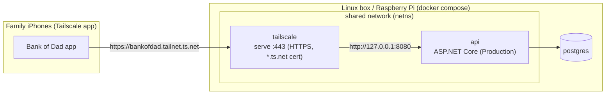

# Hosting Bank of Dad at home (Tailscale)

Run the backend on an always-on Linux box or Raspberry Pi and reach it from every family iPhone, at home or away, with trusted HTTPS. No spare hardware? Run the same stack on a small Azure VM with [`azure/`](azure/README.md).



- **Only reachable over the tailnet.** Nothing is published on the LAN. The API is also on `127.0.0.1:8080` on the box, for health checks.
- **Trusted HTTPS.** Tailscale provisions a real certificate for the node's `*.ts.net` name, so the app needs no App Transport Security exceptions.
- **Prebuilt image.** The API image (`linux/amd64` + `linux/arm64`) is built by [`.github/workflows/publish-image.yml`](../.github/workflows/publish-image.yml) and pushed to `ghcr.io/jpapiez/bankofdad-api` on every merge to `main`. Tags are `latest` and `sha-<short sha>`. The image is public, so no registry login is needed.

## Requirements

- **A server:** a Linux box or a Raspberry Pi running a **64-bit** OS (e.g. Raspberry Pi OS 64-bit or Ubuntu). It needs Docker Engine with the compose plugin, and Docker must start at boot (`sudo systemctl enable --now docker`).
- **A Tailscale account.** Each family member installs the Tailscale app on their iPhone and joins your tailnet, or you share the server with their own tailnet (see [Family devices](#family-devices)).

## 1. Prepare the tailnet (once)

In the [Tailscale admin console](https://login.tailscale.com/admin):

1. **DNS:** enable **MagicDNS** and **HTTPS Certificates**. Certificates are recorded in public Certificate Transparency logs, so the node name and tailnet name (`bankofdad.<tailnet>.ts.net`) become publicly visible. The server is still reachable only from your tailnet.
2. **Settings → Keys → Generate auth key.** The key is only used for the server's first login; afterwards its identity lives in the `tailscale-state` volume.
   - **Recommended:** tag the node. Add `"tagOwners": {"tag:bankofdad": ["autogroup:admin"]}` to your access-control policy, generate the key with the `tag:bankofdad` tag, and set `TS_EXTRA_ARGS=--advertise-tags=tag:bankofdad`. Tagged nodes don't expire.
   - **Without a tag:** after the node joins, open **Machines → bankofdad → Disable key expiry**. Otherwise it drops off the tailnet when its key expires (180 days by default).

## 2. Install, start, and claim the family server

The server only needs this `deploy/` folder. Copy it over, e.g. `scp -r deploy user@server:~/bankofdad`, or clone the repository. Then:

Set `TS_AUTHKEY` in `.env` if this is the first Tailscale start, then run the setup helper with the canonical address family phones will use:

```sh
cd ~/bankofdad
cp .env.example .env
# edit TS_AUTHKEY and TS_EXTRA_ARGS when needed
./setup.sh https://bankofdad.<tailnet>.ts.net
```

The helper:

1. Generates missing PostgreSQL, JWT, and setup secrets with restrictive file permissions.
2. Starts the Compose stack and waits with a bounded readiness check.
3. Verifies that the API advertises the requested canonical origin.
4. Prints the server URL and one-time setup code.

Open the printed URL, enter the setup code, and scan the resulting QR from **Bank of Dad > Connect your family server**. The app confirms the hostname and capabilities before it creates the first parent and the server's only family. After that transaction completes, the setup code is permanently inactive unless the last parent deletes the family.

From any device on the tailnet: `curl https://bankofdad.<tailnet>.ts.net/health` → `Healthy`. The first HTTPS request provisions the certificate and can take a few seconds.

The compose file refuses to start without `POSTGRES_PASSWORD` and `JWT_SIGNING_KEY`. The API runs in **Production**: it requires a 32+ character signing key, hides exception details and OpenAPI, and can't enable the Development-only test hooks. Database migrations are applied automatically at startup.

## 3. Connect family phones

The App Store/TestFlight app no longer needs a server URL compiled into it:

- The first parent scans the setup QR from the server root.
- A parent creates a co-parent or child invitation from **Family** and shows or shares its QR.
- The invited phone confirms the same server identity before account setup.
- Parents use email/password. Children choose a unique username with either a password or a numeric PIN; the deployment-wide PIN minimum defaults to 6 and can be set from 4 through 12 with `CHILD_PIN_MIN_LENGTH`.

One app installation stores one active family server. **Settings > Switch Family Server** signs out and removes that server's credentials from the phone before another server is selected.

Public origins must use trusted HTTPS. Certificates do not need to be purchased: Tailscale certificates, Caddy/Let's Encrypt, and Cloudflare Tunnel can provide them at no charge. Plain HTTP is accepted only for loopback, `.local`, link-local, and private IP addresses, and the app requires an explicit security confirmation because credentials and family data are not encrypted.

## Family devices

The app only works when the phone can reach the tailnet. That covers home Wi-Fi, cellular and anywhere else, as long as Tailscale is connected on the phone. Each person either:

- **Joins your tailnet:** invite them from **Users → Invite users**. They install Tailscale from the App Store and sign in.
- **Uses their own tailnet:** use **Machines → bankofdad → Share** to share just the server with them.

Optionally, restrict access in your access-control policy so tailnet members can only reach `tag:bankofdad:443`. Don't enable Tailscale Funnel: that would put the API on the public internet.

## Updating

```sh
./setup.sh https://bankofdad.<tailnet>.ts.net
```

The helper preserves every existing secret, pulls/starts the configured image, and reports that the setup code is inactive after initialization. To hold or roll back to a specific build, set `BANKOFDAD_IMAGE=ghcr.io/jpapiez/bankofdad-api:sha-<short sha>` in `.env`.

## Apple services on public self-hosted servers

Ordinary self-hosted deployments intentionally do not receive the App Store app owner's Sign in with Apple or APNs private keys:

- Parent access uses email/password.
- Child access uses username/password or username/PIN.
- Reminders and receipts remain available in the in-app Inbox.
- The server descriptor reports Apple auth and push as unsupported, so iOS hides Apple enrollment and does not request notification permission.

An official/custom app deployment may provide all Apple/APNs settings and matching private keys; capabilities are advertised only when complete operational configuration is present.

## Backups

```sh
# Back up
docker compose exec -T db pg_dump -U bankofdad -Fc bankofdad > bankofdad-$(date +%F).dump
# Restore (replaces current data)
docker compose exec -T db pg_restore -U bankofdad -d bankofdad --clean --if-exists < bankofdad-YYYY-MM-DD.dump
```

## Troubleshooting

| Symptom | Fix |
|---|---|
| `docker compose logs tailscale` shows a login URL or `NeedsLogin` | The auth key is missing, used or expired. Set a fresh `TS_AUTHKEY` and run `docker compose up -d`, or open the printed URL to approve the node. |
| The node vanished from the tailnet after months | Its key expired. Disable key expiry or tag the node (step 1), then re-authenticate as above. |
| Certificate or HTTPS errors in the app | Enable **HTTPS Certificates** in the tailnet DNS settings, and use the full `https://<node>.<tailnet>.ts.net` name. |
| The root page rejects the setup code | Run `./setup.sh <public-url>` on the host and use the exact code it prints. Codes are rate-limited and become inactive after family creation. |
| The app says the origin or server identity does not match | Do not continue. Re-run `setup.sh` with the exact URL used by phones and make sure a reverse proxy is not redirecting to another host. |
| The API is unreachable after the `netns` container was restarted by hand | `tailscale` and `api` share `netns`'s network. Run `docker compose restart tailscale api` to re-attach them. Restarting `tailscale` or `api` on their own is safe. |
| Start over with a new Tailscale identity | `docker compose down && docker volume rm bankofdad_tailscale-state`, then `docker compose up -d` with a fresh key. |
