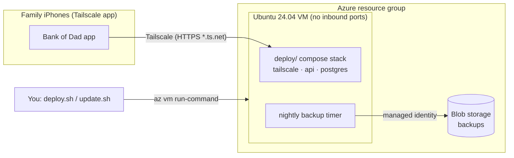

# Hosting Bank of Dad on an Azure VM (Tailscale)

This runs the same [`deploy/`](..) compose stack as a home server on one small Azure VM:

- The containers are Postgres, `netns`, the Tailscale sidecar and the API.
- The phones still reach the API over Tailscale at `https://<node>.<tailnet>.ts.net`.
- No inbound ports are open to the internet.
- You manage the VM from your machine with `az vm run-command`, so it needs no SSH.



## Cost

These are pay-as-you-go prices in West US 2 at the time of writing. Check the [pricing calculator](https://azure.microsoft.com/pricing/calculator/) for your region.

| Resource | Size | ~Monthly |
|---|---|---|
| VM | `Standard_B2ats_v2` (2 vCPU, 1 GiB, plus 2 GiB of swap) | $6.86 |
| OS disk | 30 GiB Standard SSD (E4) | $2.40 |
| Public IP | Standard, static. Used for outbound traffic only; see below. | $3.65 |
| Blob storage | Nightly `pg_dump`s, kept for 30 days | < $0.10 |
| **Total** | | **≈ $13** |

- **Arm VMs:** `Standard_B2pts_v2` is about $0.70 a month cheaper. Set `AZ_OS_IMAGE_SKU=server-arm64` to use it; the image is multi-arch.
- **Why a public IP:** since March 31, 2026, new Azure virtual networks don't get outbound internet access by default ([docs](https://learn.microsoft.com/azure/virtual-network/ip-services/default-outbound-access)). A public IP is the cheapest explicit way to provide it. The network security group has no allow rules, so nothing can connect in.

## What gets created

- **`main.bicep`:**
  - a virtual network, a network security group and a public IP;
  - the VM: Ubuntu 24.04 LTS, Trusted Launch, SSH keys only, a system-assigned managed identity, and boot diagnostics, which also enables the serial console;
  - a storage account with shared-key access disabled, a `backups` container and a lifecycle rule that deletes old backups;
  - a role assignment that lets the VM's identity write to that container.
- **`cloud-init.yaml`** runs on first boot. It installs Docker Engine from Docker's apt repository and adds a 2 GiB swapfile. It also sets up unattended upgrades for Ubuntu security updates and Docker Engine, rebooting at 11:00 UTC when an update requires it. Azure fixes this file and the SSH key when the VM is created, so re-running `deploy.sh` doesn't reapply them; to pick up changes, back up, delete the VM, deploy again and restore.
- **`update.sh`** bundles the compose file, the Tailscale serve config, [`vm/`](vm) and your settings, and runs [`vm/apply.sh`](vm/apply.sh) on the VM. `apply.sh`:
  - installs everything into `/opt/bankofdad`;
  - generates the Postgres password, JWT key, and one-time family setup code the first time;
  - pulls the image and starts the stack;
  - enables the nightly backup timer (10:00 UTC);
  - prints the API health and the node's `ts.net` URL.

The templates don't contain any account-specific values. Keep your settings outside this repository, for example in a private deployment repo (see [Automating deploys](#automating-deploys-from-a-private-repo)).

## Requirements

- An Azure subscription where you can create resources and role assignments (Owner, or Contributor plus Role Based Access Control Administrator).
- On your machine: the [Azure CLI](https://learn.microsoft.com/cli/azure/install-azure-cli) (`az login`), `jq`, and an SSH public key.
- A prepared tailnet (MagicDNS and HTTPS certificates enabled) and an auth key. Follow [step 1 of the home-server guide](../README.md#1-prepare-the-tailnet-once).

## Deploy

```sh
az login
az account set --subscription "<subscription name or id>"

export AZ_RESOURCE_GROUP=rg-bankofdad AZ_LOCATION=westus2
export TS_AUTHKEY=tskey-auth-...            # only needed for the first deploy
export TS_EXTRA_ARGS=--advertise-tags=tag:bankofdad
deploy/azure/deploy.sh
```

The first run takes about 5–10 minutes. It ends with output like:

```
API health: Healthy
Tailscale: Running
URL: https://bankofdad.<tailnet>.ts.net
```

The command output prints the one-time setup code. Open the HTTPS URL, enter that code, and scan the setup QR from the app.

### Settings

`update.sh` reads these environment variables. `deploy.sh` reads the Azure ones and then runs `update.sh`.

| Variable | Default | Purpose |
|---|---|---|
| `AZ_RESOURCE_GROUP` | `rg-bankofdad` | Resource group; it's created if missing. |
| `AZ_LOCATION` | `westus2` | Region, used when creating the resource group. |
| `AZ_NAME_PREFIX` | `bankofdad` | Prefix for resource names. |
| `AZ_VM_SIZE` | `Standard_B2ats_v2` | VM size. |
| `AZ_OS_IMAGE_SKU` | `server` | Use `server-arm64` for Arm sizes. |
| `SSH_PUBLIC_KEY` or `SSH_PUBLIC_KEY_FILE` | `~/.ssh/id_ed25519.pub` | Admin SSH key. Azure requires one. Only used when the VM is created; later runs ignore it. |
| `BACKUP_RETENTION_DAYS` | `30` | Days to keep backups. |
| `TS_AUTHKEY` | | Tailscale auth key (use a one-off key). Required for the first deploy; not needed once the node has joined. |
| `TS_HOSTNAME` | `bankofdad` | Node name, which becomes `https://<name>.<tailnet>.ts.net`. |
| `TS_EXTRA_ARGS` | | For example `--advertise-tags=tag:bankofdad`. |
| `BANKOFDAD_IMAGE` | `ghcr.io/jpapiez/bankofdad-api:latest` | Pin `:sha-<short sha>` to hold a version. |
| `PUBLIC_BASE_URL` | required | Canonical HTTPS origin used by family phones, such as `https://bankofdad.<tailnet>.ts.net`. |
| `CHILD_PIN_MIN_LENGTH` | `6` | Deployment-wide child PIN minimum, from 4 through 12. |
| `APPLE_CLIENT_ID`, `APPLE_TEAM_ID`, `APPLE_KEY_ID`, `APPLE_TOKEN_ENCRYPTION_KEY`, `APNS_KEY_ID`, `APNS_TEAM_ID`, `APNS_BUNDLE_ID`, `APNS_USE_SANDBOX` | empty/default | Optional official/custom-app Apple auth and push configuration. Ordinary self-hosting leaves it disabled and uses Inbox. |
| `APPLE_KEY_FILE` | | Local path to `SignInWithAppleKey.p8`; required only when `APPLE_KEY_ID` is configured. Later updates retain an installed key. |
| `APNS_KEY_FILE` | | Local path to your APNs `AuthKey.p8`. It's copied to the VM. |
| `GHCR_USER`, `GHCR_TOKEN` | | Only needed if `BANKOFDAD_IMAGE` points at a private registry image (a token with `read:packages`). The default image is public. |

`update.sh` rewrites settings on every run, so always provide `PUBLIC_BASE_URL` and your full settings set. `TS_AUTHKEY` is needed only once. Existing optional Apple/APNs key files are retained when omitted.

## Update

Use this to pick up a new image, a change to `deploy/docker-compose.yml`, or new settings:

```sh
deploy/azure/update.sh
```

It pulls the latest image, recreates changed containers, waits for readiness, and either prints the one-time setup code or confirms that setup is complete. To roll back, set `BANKOFDAD_IMAGE=ghcr.io/jpapiez/bankofdad-api:sha-<short sha>` and run it again. To change Azure resources, run `deploy.sh` again.

## Backups and restore

`bankofdad-backup.timer` uploads a `pg_dump` to the `backups` container every night. To run commands on the VM:

```sh
vm() { az vm run-command invoke -g rg-bankofdad -n bankofdad-vm --command-id RunShellScript --scripts "$1" --query 'value[0].message' -o tsv; }

vm '/opt/bankofdad/backup.sh'                  # back up now
vm '/opt/bankofdad/backup.sh list'             # list backups
vm '/opt/bankofdad/backup.sh restore latest'   # replace the database with the newest backup
```

To download a backup, you need **Storage Blob Data Reader** on the storage account, because shared-key access is disabled:

```sh
az storage blob download --auth-mode login --account-name <account> -c backups -n <name> -f bankofdad.dump
```

Restoring onto a new VM works the same way. The new VM generates a new JWT key, so everyone signs in again and kid devices need to pair again.

## Access and troubleshooting

| Need | How |
|---|---|
| Logs and status | `vm 'cd /opt/bankofdad && docker compose ps && docker compose logs --tail 50 api tailscale'` |
| A shell | Use the [serial console](https://learn.microsoft.com/troubleshoot/azure/virtual-machines/linux/serial-console-linux) in the Azure portal. The admin user has no password, so set one first with **Help → Reset password** in the portal. |
| First boot still running | `apply.sh` waits for cloud-init. Check its progress with `vm 'cloud-init status --long'`. |
| `Tailscale is not logged in` | Set a fresh `TS_AUTHKEY` and run `update.sh`. Interactive login links don't work here: without a key, the container restarts every minute with a new node key. |
| `update.sh` says another run command is in progress | Only one run command can run at a time. Wait a minute and try again. |

See also the [home-server troubleshooting](../README.md#troubleshooting).

## Automating deploys from a private repo

Keep your subscription, resource group and Tailscale settings in a **private** repository. That repository runs `deploy.sh` or `update.sh` from a pinned BankOfDad ref using GitHub Actions and [OpenID Connect](https://learn.microsoft.com/azure/developer/github/connect-from-azure-openid-connect), so no Azure secret is stored:

1. Create a user-assigned managed identity. Add a federated credential for your deployment repo's `production` environment. Grant the identity **Owner** on the resource group (needed for the backup role assignment).
2. In the deployment repo, set these Actions variables: `AZURE_CLIENT_ID`, `AZURE_TENANT_ID`, `AZURE_SUBSCRIPTION_ID`, `PUBLIC_BASE_URL`, the settings above, and `BANKOFDAD_REF`. Store `TS_AUTHKEY` as an environment secret. Apple secrets are needed only for an official/custom app deployment.
3. The workflow checks out `jpapiez/BankOfDad` at `BANKOFDAD_REF`, runs `azure/login` with `id-token: write`, then runs `deploy/azure/deploy.sh` (or `update.sh`).

## Tear down

```sh
az group delete -n rg-bankofdad
```

This deletes the VM, the disk (including the database) **and the backups**. Download a backup first.
